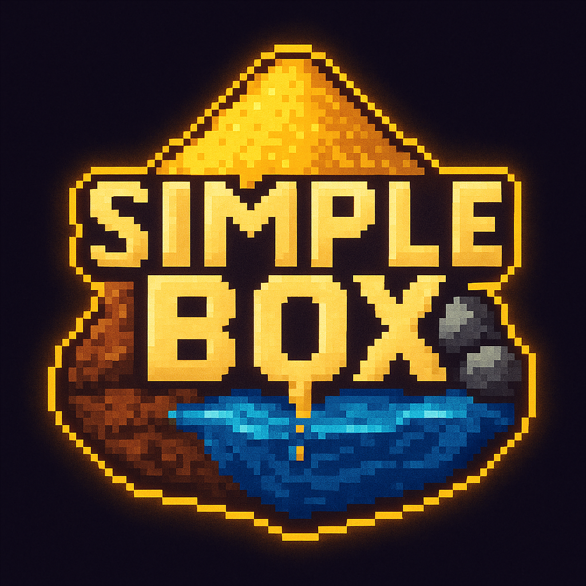

# SimpleBox (C++ / SFML)
**SimpleBox** is a 2D sandbox inspired by games like *sand:box* or *The Powder Toy*, where the player can interact with different materials - sand, water, rocks, soil, etc. - in a pixelated world. Each material has its own behavior, which is determined by a **cellular automaton**, allowing you to create believable simulations of physical processes.

## Info

**Project name:** SimpleBox\
**Logo:**\
\
**Version:** 0.1\
**Programming language:** C++ 17\
**Libraries:** SFML\
**Technologies:** CMake, Git\
**IDE:** Visual Studio 2022\
**Languages:** English\
**Developer:** NikitaByte

## Navigation 🧭
- [Info](#info)
- [Program features](#program-features)
- [How to Build and Run](#how-to-build-and-run-)
  - [Requirements](#-requirements)
  - [Windows](#-windows)
  - [Linux](#-linux)
  - [MacOS](#-macos)
  - [Cross-Platform](#-cross-platform)
- [Controls](#controls-)
- [Ideas](#ideas-)
- [License](#license-)

## Program features
- 🧱 **Realistic behavior of materials** - sand falls down, water flows, soil mixes.
- 🎨 **Pixel graphics** - each material has a unique color and appearance.
- 🖌️ **Brush** - the player can paint with materials on the playing field by changing the size and pressure.
- 🧠 **Cellular machine** - each cell on the field is updated according to the rules, depending on the type of material and its neighbors.
- ⏱️ **Optimized simulation** - using an array of vertexes to render the playing field allows you to immediately draw it in the window.
- ⚙️ **Scalable architecture** - easy to add new materials or change simulation rules.
- 📁 **CMake build automation**.

## How to Build and Run 🔨

### 📦 Requirements
- CMake (version 3.8 or higher)
- A C++ compiler:
  - GCC / Clang (Linux, macOS)
  - MSVC (Windows)
- Optionally: an IDE (Visual Studio, CLion, VSCode)

### 🪟 Windows
#### Option 1: Using Visual Studio
1. Install:
   - [CMake](https://cmake.org/download/)
   - [Visual Studio](https://visualstudio.microsoft.com/) with the "Desktop development with C++" workload
2. Generate Project Files:
   - Open **CMake GUI**
   - Set:
     - `Where is the source code:` path to your project root
     - `Where to build the binaries:` path to `build/` directory
   - Click **Configure** → choose your Visual Studio version
   - Click **Generate**
   - Click **Open Project**
3. Build and Run:
   - Press `Ctrl + F5` in Visual Studio to build and run

#### Option 2: Using Command Line
```bush
# Open "x64 Native Tools Command Prompt for VS"
cd path\to\project
mkdir build
cd build
cmake ..
cmake --build . --config Release
.\Release\YourExecutable.exe
```

### 🐧 Linux
Using GCC or Clang:
```bush
sudo apt update
sudo apt install cmake g++     # or clang

cd path/to/project
mkdir build
cd build
cmake ..
make
./YourExecutable
```

### 🍎 MacOS
Using Terminal:
```bush
brew install cmake

cd path/to/project
mkdir build
cd build
cmake ..
make
./YourExecutable
```
>[!NOTE]
> You can also open the project in CLion, which supports CMake natively.
### 💻 Cross-Platform
Using **VS Code + CMake Tools** Extension:
1. Install:
   - [VS Code](https://code.visualstudio.com/)
   - CMake Tools extension
   - C++ compiler & CMake
2. Open the project folder in VS Code
3. Press `Ctrl + Shift + P` → **CMake: Configure**
4. Press `F7` to build, `F5` to run/debug

## Controls 🎮
- Select a material:
  - **1** - Sand
  - **2** - Dirt
  - **3** - Stone
  - **4** - Water
  - **5** - Brick
  - **6** - Oil
  - **7** - Smoke
- **Left Mouse Click** - Spawn material
- **Right Mouse Click** - Erase
- **+** - Increase brush size
- **-** - Decrease brush size
- **P** - Change brush shape
- **Arrow Up** - Increase brush solidity
- **Arrow Down** - Decrease brush solidity
- **Arrow Right** - Scaling up
- **Arrow Left** - Scaling down
- **F** - Enable/Disable FPS
- **C** - Clear screen
- **B** - Enable/Disable borders
- **V** - Resize view/Сhange window mode (Fit/Stretch)
- **F11** - Displaying the game (Window/Fullscreen)
- **Pause** - Pause
- **ESC** - End the game

## Ideas 💡
- 📱 GUI
- 🔥 Fire and explosions
- 🧊 Temperature effects (melting, evaporation)
- ⚡ Electricity or logic components
- 🌱 Biological materials (herbs, bacteria)
- 🌪️ Interactive environment: wind, pressure

## License 📜
Distributed under the MIT License. See `LICENSE` for more information.
